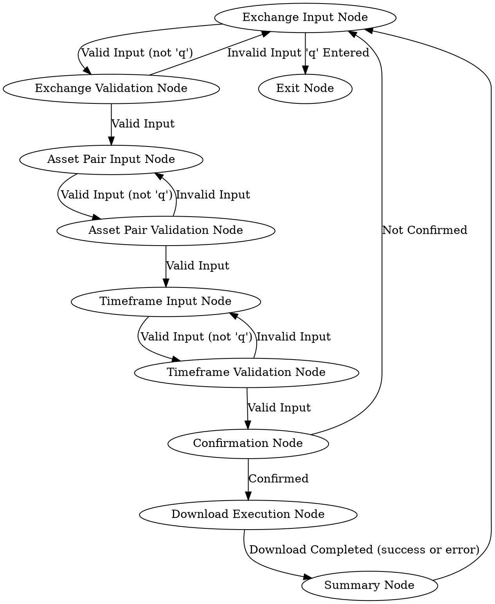

================================================
File: docs/design.md
================================================
---
layout: default
title: "Design"
---

# System Design

## Node Flow Diagram

## Data Schema

*(This section can be expanded to detail the shared data structure if needed)*

- **Shared Memory (shared_memory.json):**
  - Stores the last valid inputs for `exchange`, `asset_pair`, and `timeframe` to be used as defaults.
  - Stores intermediate validation results and command outputs.

## Utility Functions

- **`utils/call_llm.py`**:  Handles calls to the Language Model for input validation and summary generation.

## Node Descriptions

- **Exchange Input Node**: Prompts the user for the exchange, using the last entered exchange as a default. Allows quitting with 'q'.
- **Exchange Validation Node**: Validates the exchange input using an LLM against a predefined list of exchanges.
- **Asset Pair Input Node**: Prompts the user for the asset pair, using the last entered asset pair as a default. Allows quitting with 'q'.
- **Asset Pair Validation Node**: Validates the asset pair input using an LLM, ensuring it's in the correct format.
- **Timeframe Input Node**: Prompts the user for the timeframe, using the last entered timeframe as a default. Allows quitting with 'q'.
- **Timeframe Validation Node**: Validates the timeframe input using an LLM against a predefined list of timeframes.
- **Confirmation Node**: Asks the user to confirm the download parameters before proceeding.
- **Download Execution Node**: Executes the `freqtrade download-data` command with the validated parameters.
- **Summary Node**: Summarizes the output of the download command using an LLM and provides feedback to the user.
- **Exit Node**:  Provides a thank you message and ends the program.

This completes the refactoring of the input and validation process into separate nodes. Let me know if you have any questions or further adjustments!