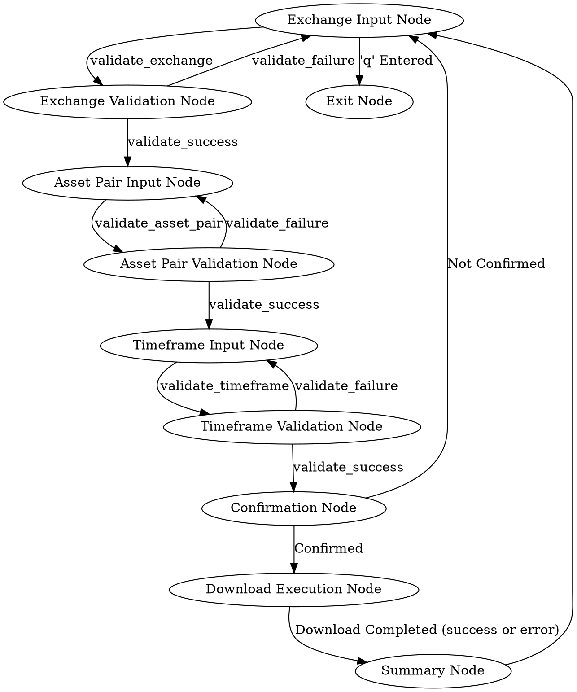

================================================
File: docs/design.md
================================================
---
layout: default
title: "Design"
---

# System Design

## Node Flow Diagram

## Data Schema

*(This section can be expanded to detail the shared data structure if needed)*

- **Shared Memory (shared_memory.json):**
  - Stores the last valid inputs for `exchange`, `asset_pair`, and `timeframe` to be used as defaults.
  - Stores intermediate validation results and command outputs.
  - `field_value`: temporarily stores the user input to be validated.
  - `validation_result`: stores the result from the `ValidationNode`.
  - `validation_error_message`: stores the error message from the `ValidationNode` in case of validation failure.

## Utility Functions

- **`utils/call_llm.py`**:  Handles calls to the Language Model for input validation and summary generation.

## Node Descriptions

- **Exchange Input Node**: Prompts the user for the exchange, using the last entered exchange as a default. Allows quitting with 'q'. Returns action `validate_exchange` to trigger validation.
- **Exchange Validation Node**: Validates the exchange input using an LLM against a predefined list of exchanges. Returns action `validate_success` or `validate_failure`.
- **Asset Pair Input Node**: Prompts the user for the asset pair, using the last entered asset pair as a default. Allows quitting with 'q'. Returns action `validate_asset_pair` to trigger validation.
- **Asset Pair Validation Node**: Validates the asset pair input using an LLM, ensuring it's in the correct format. Returns action `validate_success` or `validate_failure`.
- **Timeframe Input Node**: Prompts the user for the timeframe, using the last entered timeframe as a default. Allows quitting with 'q'. Returns action `validate_timeframe` to trigger validation.
- **Timeframe Validation Node**: Validates the timeframe input using an LLM against a predefined list of timeframes. Returns action `validate_success` or `validate_failure`.
- **Confirmation Node**: Asks the user to confirm the download parameters before proceeding.
- **Download Execution Node**: Executes the `freqtrade download-data` command with the validated parameters.
- **Summary Node**: Summarizes the output of the download command using an LLM and provides feedback to the user.
- **Exit Node**:  Provides a thank you message and ends the program.

With these changes, the validation logic is now correctly placed in the flow definition, and the input nodes are focused on input collection. Let me know if you have any other adjustments!