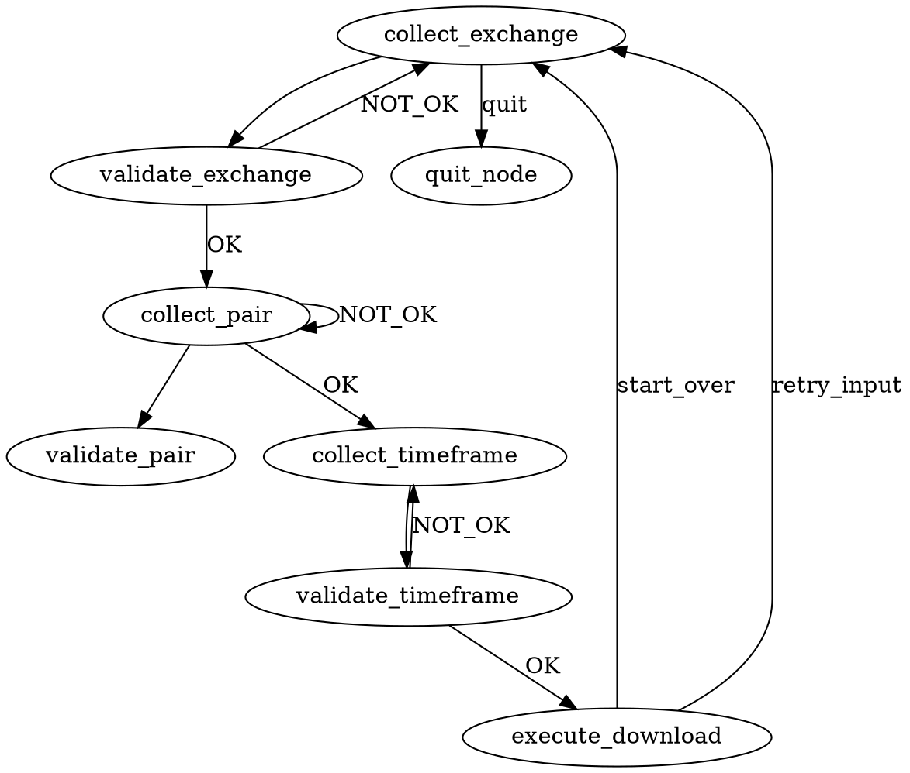

```dot
digraph {
    collect_exchange -> validate_exchange;
    validate_exchange -> collect_pair [label="OK"];
    validate_exchange -> collect_exchange [label="NOT_OK"];
    collect_pair -> validate_pair;
    collect_pair -> collect_timeframe [label="OK"];
    collect_pair -> collect_pair [label="NOT_OK"];
    collect_timeframe -> validate_timeframe;
    validate_timeframe -> execute_download [label="OK"];
    validate_timeframe -> collect_timeframe [label="NOT_OK"];
    execute_download -> collect_exchange [label="start_over"];
    execute_download -> collect_exchange [label="retry_input"];
    collect_exchange -> quit_node [label="quit"];
}
```
