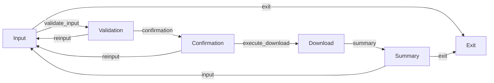

# Freqtrade AI Download Assistant



This assistant guides you through the process of downloading historical data for Freqtrade using an interactive command-line interface.
It leverages a conversational flow to help you specify the exchange, asset pair, and timeframe for the data you need.

## Features

*   **Interactive Guided Download:** Step-by-step prompts to collect necessary information for data download.
*   **Input Validation:** Uses Language Models (LLMs) to validate user inputs and ensure correct data format.
*   **Freqtrade Integration:** Generates and executes `freqtrade download-data` commands based on your specifications.
*   **Configuration Files:** Stores downloaded data configurations in JSON files for easy access and reuse (e.g., `freq-data/ALGO_USDT-1w.json`).

## Requirements

*   **Freqtrade Installation:** Ensure you have Freqtrade installed and configured correctly.
*   **Python Environment:** Python 3.7 or higher.
*   **reqs.md** file was used to guide the AI coding tool while creating the project.
*   **Dependencies:** Install necessary Python packages. See `REQUIERMENTS.md` for details (if available).

## Usage

To run the assistant, execute the main script (e.g., `flow.py`) within the `freq_assistant` directory.

```bash
cd freq_assistant
python flow.py  # Or the name of the main script
```

The assistant will then guide you through the data download process, prompting you for the required information.

## Documentation

*   **POCKETFLOW.md:** For details about the underlying workflow engine and node structure, refer to `POCKETFLOW.md`.
*   **CONVENTIONS.md:** See `CONVENTIONS.md` for coding conventions and guidelines used in this project.

## Contributing

[Contribution guidelines, if applicable]

## License

[License information, if applicable]
