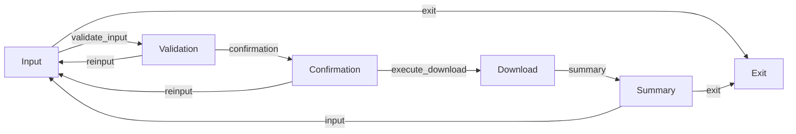

# Freqtrade Download Assistant Requirements (Revised)

Below is the updated specification for a Freqtrade Download Assistant that guides users through downloading historical data for Freqtrade using a step-by-step conversational flow.

---

## 1. Step-by-Step Input Prompts

- **Guided Prompts:** The assistant will prompt the user for each input field individually in a conversational manner:
    - First, prompt for **Exchange**.
    - Then, prompt for **Asset Pair**.
    - Finally, prompt for **Timeframe**.
- **Exit Option:** At any point during input, if the user types `"q"` or `"quit"`, immediately exit and display a thank-you message.
- **Default Handling (Asset Pair):** When prompting for the asset pair, instruct the user that if the quote currency is omitted, it defaults to `"USDT"`.

---

## 2. Input Validation Loop

- **Individual Field Validation:** After each input, the assistant will validate the provided field using an LLM call with a structured prompt.
    - **Exchange Validation:** Must be one of `binance`, `ftx`, `kucoin`, or `coinbase`.
    - **Asset Pair Validation:** Must follow the `BASE/QUOTE` format (default to `USDT` if the quote is missing and standardize the base if necessary).
    - **Timeframe Validation:** Must be one of `1d`, `3d`, `1w`, `2w`, `1M`, `3M`, `6M`, or `1y`.
- **Incremental Error Reporting:** If an input is invalid:
    - Re-prompt the user for the *same* field that was invalid.
    - Display a clear error message indicating what is wrong and how to correct it.
    - The loop continues for the current field until valid input is provided or the user quits.

---

## 3. Download Confirmation

- **Summary & Confirm:** Once all inputs (exchange, asset pair, timeframe) are successfully collected and validated:
    - Display a confirmation summary of all collected inputs (exchange, asset pair, and timeframe).
    - Prompt the user to confirm if they want to proceed with the download using these parameters.
    - **If Confirmed:** Proceed to execute the download.
    - **If Not Confirmed:** Restart the input process from the beginning, clearing all previously collected information.

---

## 4. Download Execution & Summarization

- **Command Execution:** Upon confirmation, execute the `freqtrade download-data` command in the terminal using the validated parameters:
  ```bash
  freqtrade download-data --userdir ./freq-user-data --data-dir ./freq-data --data-format-ohlcv json --exchange {exchange} -t {timeframe} --timerange=20200101- -p {pair}
  ```
- **Output Summarization:**
    - After the download command finishes, the assistant will display a summary of the download process to the user.
    - **On Success:** If the download is successful (return code 0), summarize the output and provide options to either start a new download with different parameters (Input) or Quit.
    - **On Failure:** If the download fails (non-zero return code), summarize the error output and provide options to Retry the download with the same parameters, start a new download with different parameters (Input), or Quit.

---
**Note:** The assistant now uses a step-by-step input process and validates each field individually before proceeding to the next step. Error handling and user guidance are provided at each stage to ensure a smooth and interactive user experience.

---

## 5. Flowchart



---
