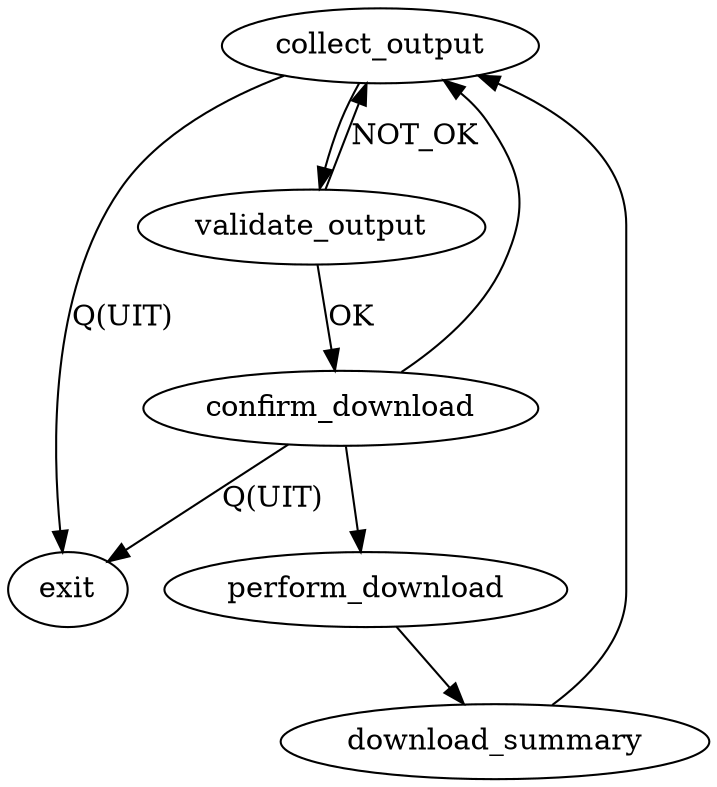

The flow should be as follows:

```dot

digraph {
    collect_output -> exit [label="Q(UIT)"];
    collect_output -> validate_output;
    validate_output -> confirm_download [label="OK"];
    validate_output -> collect_output [label="NOT_OK"];
    confirm_download -> perform_download
    confirm_download -> collect_output
    confirm_download -> exit [label="Q(UIT)"]
    perform_download -> download_summary
    download_summary -> collect_output
}    

```